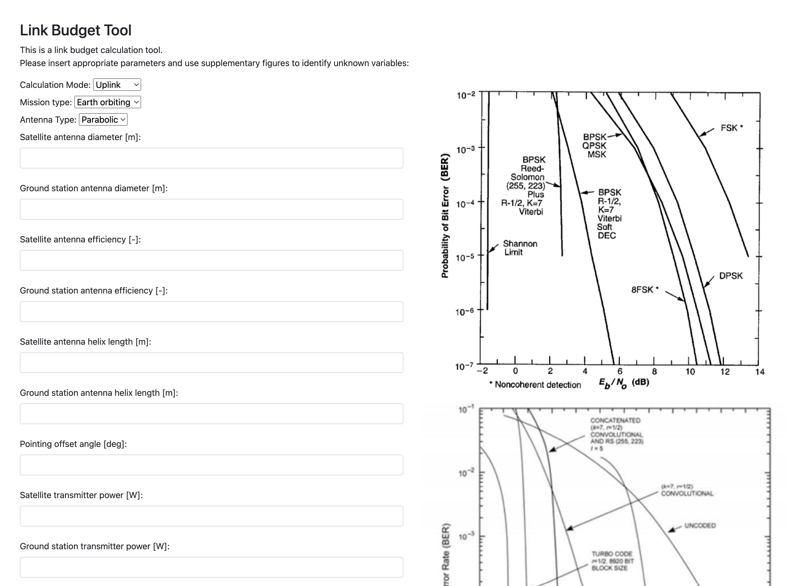

This is an interactive link budget calculation tool for AE2111-II Aerospace Design & System Engineering Elements II

To start the tool, run main.py, which initiates local Flask server. The frontend of the application is available on http://127.0.0.1:9696/
You should expect to see the following: 

